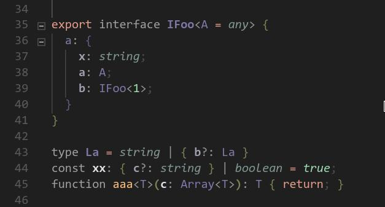
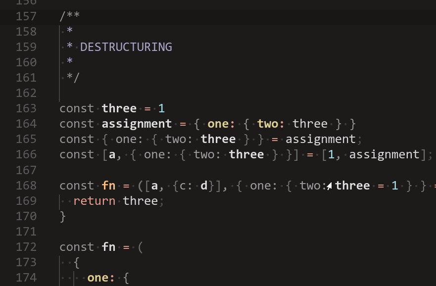

# VsCode Null Syntax Theme

+ [Type Annotations](#type-annotations)
+ [Destructuring](#destructuring)
+ [Contributing](#contributing)
+ [Links](#links)

A theme which focuses on:
- Fading punctuation and annotations
- Highlighting control flow

## Type Annotations

## Destructuring 

## Contributing

- Clone project
- Hit `F5`. Debugs the current workspace in a new window, showing theme changes as you commit them.
- Run `yarn dev` to watch and build.
- Modify the theme, save, you should see changes appear in the debugged editor window.

## Links

- https://code.visualstudio.com/api/language-extensions/semantic-highlight-guide#theming
